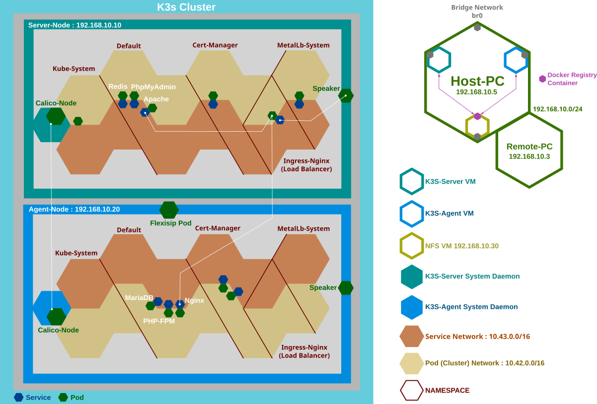
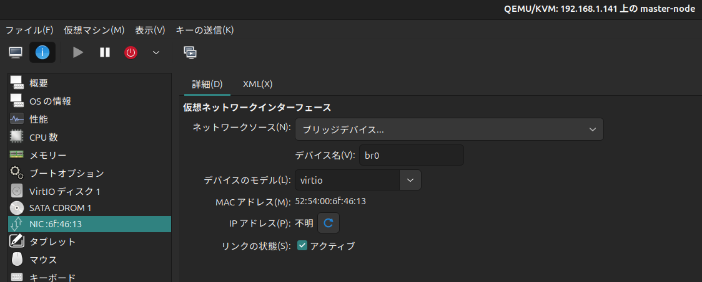

# Flexisip + Flexisip Account Manager on K3s(Kebernetes)

Running flexisip server and account manager under the K3s(Kubernetes) system.

---

## Virtual Machines Specifications 

 * 3 VMs (Node-VM:2, NFS-VM:1)created by **QEMU/KVM**
 * Each VM : CPU 2 cores, Memory 2 GB, Storage 20 GB
 * VM Base OS : Ubuntu Server 24.04
 * Virtual Bridge Network Interface br0（Each VM could be assigned IPv4/IPv6 by DHCP）

## K3s System Requirements

 * Multi Nodes : **Master(Server)-Node** 1, **Worker(Agent)-Node** 1 (Each node could be expandable)
 * NFS (For Persistent Volume and Persistent Volume Claim)
 * Adopted **MetalLB** as an alternative Load Balancer for K3S default ServiceLB
 * Adopted **Calico** as an alternative CNI plugin for K3S default Flannel
 * Dual Stuck for IPv4/IPv6
 * OS : Ubuntu Server 24.04



> NOTE : Not included volume and config files for each pod (Only the manifest yaml files).

---

## Operations on the host machine

### Install KVM/QEMU

Install the below CLI packages for QEMU/KVM

```shell
$ sudo apt install qemu-kvm libvirt-daemon-system libvirt-clients virtinst
```

Check libvirtd system daemon started

```shell
$ sudo systemctl status libvirtd
● libvirtd.service - libvirt legacy monolithic daemon
.....
.....
```

Add an user to "libvirt" group (for activating it, need to logout and login)

```shell
$ sudo usermod -aG libvirt $USER
```

libvirt commands : virsh, virt-install
```shell
$ virsh list --all
 Id   Name          State
-----------------------------
 5    ubuntu24.04   running

$ virsh domblklist ubuntu24.04
 Target   Source
-----------------------------------------------------
 vda      /var/lib/libvirt/images/ubuntu24.04.qcow2
 sda      -

$ virsh pool-list
 Name      State    Autostart
-------------------------------
 default   active   yes
```

> Note : Could be used GUI Vert-Manager on the remote machine.


### Create Bridge Network Interface `br0`

Create the virtual bridge network interface `br0` so that each VM can obtain an IP address from the DHCP server on the host machine's LAN.

Edit the below netplan config file;

`/etc/netplan/netplan.yaml`
```yaml
network:
  version: 2
  ethernets:
    enoXX:
      dhcp4: no
      dhcp6: no
  bridges:
    br0:
      interfaces: [enoXX]
      dhcp4: no
      dhcp6: no
```

Restart Netplan

```shell
$ sudo netplan apply
```

### Install libguestfs-tools

https://libguestfs.org/

* **Overview**: A set of tools for manipulating and editing virtual machine images (disk images).

* **Purpose**: Allows direct access to the contents of image files—such as file systems, configuration files, and partitions—without booting the virtual machine.

```shell
$ sudo apt install libguestfs-tools
```

Setting up SSH keys (for cloning later)

```shell
$ ssh-keygen -t ed25519
# → ~/.ssh/id_ed25519.pub
```

### Create Base VM

Create the base VM installed Ubuntu 24.04 Server (with openssh-server) 

Run the following command, or install Virt-Manager on the remote machine then create the VM with the GUI (recommended).

```shell
$ virt-install \
  --name ubuntu2404 \
  --ram 2048 \
  --vcpus 2 \
  --disk path=/var/lib/libvirt/images/ubuntu2404.qcow2,size=20,format=qcow2 \
  --os-type linux \
  --os-variant ubuntu24.04 \
  --network bridge=br0 \
  --graphics none \
  --console pty,target_type=serial \
  --cdrom /var/lib/libvirt/images/ubuntu-24.04-live-server-amd64.iso
```

On the Virt-Manager Screen, select the bridge device "br0" which has been made on the host machine.


Boot it once to update packages and enable necessary system services.

Start the SSH server and update the packages.

```shell
$ sudo systemctl start ssh
$ sudo apt update && sudo apt upgrade -y
```

The Netplan configuration will remain as is, but the interface name should be changed.

```shell
$ sudo mv /etc/netplan/50-cloud-init.yaml /etc/netplan/base-net.yaml
```

Modify the netplan setting

`/etc/netplan/base-net.yaml`
```yaml
network:
  version: 2
  ethernets:
    enpXXX: ## $ ip add
      dhcp4: yes
      dhcp6: yes
```

Change the hostname

```shell
$ sudo nano /etc/hostname ---> node001
$ sudo nano /etc/hosts ----> 127.0.1.1 node001
```

Disable cloud-init from applying settings at VM startup

```shell
$ sudo systemctl disable cloud-init
```

Register the public key from the host while the base VM is running (example)

```
$ ssh-copy-id -i ~/.ssh/id_ed25519.pub k8sadmin@BASE_VM_IP
```

### Purge Snap

When Docker is selected during the Ubuntu Server installation, the Snap version of Docker is installed by default.
However, since the K3s installation script installs the containerd container runtime via apt, both Snap and Docker are unnecessary.
If Docker is required for other purposes, install it separately using the apt package manager.

```shell
# 1. stop snap version docker
$ sudo systemctl stop snap.docker.dockerd.service
$ sudo snap stop docker

# 2. delete snap packages
$ sudo snap remove docker
$ sudo snap remove core22
$ sudo snap remove snapd

# 3. delete snapd
$ sudo apt purge snapd
$ sudo apt autoremove --purge

# 4. delete related directories
$ sudo rm -rf /snap /var/snap /var/lib/snapd /var/cache/snapd

# 5. reboot
$ sudo reboot
```

### Execute virt-sysprep 

After the shutdown of the base VM, execute virt-sysprep.

**virt-sysprep**

https://libguestfs.org/virt-sysprep.1.html

* **Overview** : A tool used to "initialize a virtual machine image for cloning" (commonly included in the libguestfs-tools package).
* **Purpose** : Cleans and resets host-specific information before creating a clone of a virtual machine.
* **Examples of what it initializes**:
 * Resets the hostname
 * Deletes SSH host keys
 * Removes logs
 * Deletes temporary files
 * Resets user passwords, etc.

Check VM

```shell
$ virsh list --all
 Id   Name          State
-----------------------------
 5    ubuntu24.04   running
```

Initialize settings that should be unique for each VM (on the base VM only).

> NOTE : If the machine-id is not unique, cloned VMs may be assigned the same IP address.

```shell
$ sudo virt-sysprep -d ubuntu24-template --operations logfiles,machine-id,udev-persistent-net
```

> NOTE : If you boot the base VM and make any changes, be sure to shut it down and run the above command on the host before creating clones.

### Create other VMs from the base VM

Use this base VM to create new VMs via Virt-Manager or the command below.

Clone VMs
 * Master(Server)-Node VM for K3s Server
 * Worker(Agent)-Node VM for K3s Agent
 * NFS VM for Local build docker images registry and K3s PV+PVC

```shell
$ virt-clone --original ubuntu24.04 --name master-node --auto-clone
$ virt-clone --original ubuntu24.04 --name worker-node001 --auto-clone
$ virt-clone --original ubuntu24.04 --name ubuntu-nfs --auto-clone
```


If the SSH server is not running on the cloned VM, check its status using the Virt-Manager console.

```shell
$ sudo systemctl status ssh
```

Change "enable" and start

```shell
$ sudo systemctl enable ssh
$ sudo systemctl start ssh
```

Each VM should have a unique hostname.
```
$ sudo nano /etc/hostname ---> nodeXXX
$ sudo nano /etc/hosts ----> 127.0.1.1 nodeXXX
```

---
---

## Operations on NFS(Network File System) VM

Install nfs-kernel-server on NFS-VM

Install and create the shared directory with appropriate permissions

```shell
$ sudo apt install nfs-kernel-server
$ sudo mkdir -p /mnt/nfs
$ sudo chown nobody:nogroup /mnt/nfs
```

Add the export configuration

```shell
$ sudo nano /etc/exports
/mnt/nfs 192.168.0.0/16(rw,sync,no_subtree_check,no_root_squash)
```

Reload or restart the NFS export settings

```shell
$ sudo exportfs -a
$ sudo systemctl restart nfs-kernel-server
```

> NOTE : Open Port : 2049/TCP

### Install Docker Registry

Deploy a Docker Registry container on the NFS VM to host and distribute Docker images privately.
Push custom images built with Podman to this private registry.

https://github.com/distribution/distribution/

#### DockerHub

 https://hub.docker.com/_/registry

#### Document

 https://distribution.github.io/distribution/


Run docker registry container

```shell
$ docker run -d -p 5000:5000 --name registry registry:3
```

### Push images built by the host machine(operation from the host machine or others)

Tag the image with a new tag (the same image will be registered under a different tag) and push it to the registry server.

 * **php-fpm-8.2:20250514**
 * **flexisip:20250514**

```shell
$ podman tag localhost/php-fpm-8.2:20250514 192.168.100.30:5000/php-fpm-8.2:20250514
$ podman tag localhost/flexisip:20250514 192.168.100.30:5000/flexisip:20250514
$ podman push --tls-verify=false 192.168.100.30:5000/php-fpm-8.2:20250514
$ podman push --tls-verify=false 192.168.100.30:5000/flexisip:20250514
```

---
---

## Operations on the Master and the Worker Node VMs

### Install the NFS client

```shell
$ sudo apt install nfs-common
```

Verify the setup from the client VM (mount the volume)

```shell
$ sudo mount -t nfs <NFS-VM-IP>:/mnt/nfs /mnt
```

Unmount

```shell
$ sudo umount /mnt
```

Confirm the connection with NFS

```shell
$ mount | grep nfs
$ showmount -e <NFS-VM-IP>
```

### Install K3s on the master and the worker node VMs

Install K3s on the Master Node VM

```shell
$ curl -sfL https://get.k3s.io | INSTALL_K3S_EXEC="\
  --cluster-cidr=10.42.0.0/16,fd00:10:42::/48 \
  --service-cidr=10.43.0.0/16,fd00:10:43::/112 \
  --disable=traefik \
  --flannel-backend=none \
  --disable-network-policy" \
  sh -
```
Output the Token for Worker Nodes

```shell
$ sudo cat /var/lib/rancher/k3s/server/node-token
K3S_TOKEN=<K3S_TOKEN>
```

Install K3s on the Worker Node VM

```shell
$ curl -sfL https://get.k3s.io | K3S_URL=https://<MASTER-IP>:6443 \
  K3S_TOKEN=<K3S_TOKEN> \
  sh -
```

### Add the local docker registry on the both VM

https://docs.k3s.io/installation/private-registry

```shell
$ sudo mkdir -p /etc/rancher/k3s
```

`/etc/rancher/k3s/registries.yaml`
```yaml
mirrors:
  "192.168.100.30:5000":
    endpoint:
      - "http://192.168.100.30:5000"
```

Restart K3s server on the Master Node VM 

```shell
$ sudo systemctl restart k3s
```

Restart K3s agent on the Worker VM

```shell
$ sudo systemctl restart k3s-agent
```

Download images from the local docker registry on the both VMs

```shell
$ sudo k3s ctr image pull --plain-http 192.168.100.30:5000/php-fpm-8.2:20250514
$ sudo k3s ctr image pull --plain-http 192.168.100.30:5000/flexisip:20250514
```

Confirm the Images

```shell
$ sudo k3s crictl images
IMAGE                                                TAG                 IMAGE ID            SIZE
192.168.1.119:5000/php-fpm-8.2                       20250514            aadc0f74f501f       109MB
192.168.1.119:5000/ubuntu-flexisip                   20250514            5ab7bfc30fb74       181MB
```

---
---

## Apply manifests on the Maser Node VM

### Inatall Calico

Download https://raw.githubusercontent.com/projectcalico/calico/v3.30.2/manifests/calico.yaml
and then edit it to add the following lines in the data.cni_network_config section:

```yaml
"ipam": {
        "type": "calico-ipam",
        "assign_ipv4": "true",
        "assign_ipv6": "true"
    },
```

and the following lines in the spec.template.spec.containers.env section:

```yaml
         - name: IP6                        
           value: autodetect           
         - name: CALICO_IPV6POOL_NAT_OUTGOING     
           value: "true"              
         - name: CALICO_IPV6POOL_CIDR       
           value: fd00:10:42::/48
```

Then, kubectl apply -f calico.yaml, # and then apply this file:

### Install MetalLB

`metallb-config.yaml` configures MetalLB to use specific IP addresses for load balancing.
It defines two IP address pools, one for IPv4 and one for IPv6, and sets up
Layer 2 advertisements for both pools. The IP addresses specified in the pools
should be available in your network and not conflict with other devices.
Make sure to apply this configuration after setting up MetalLB in your Kubernetes cluster.

```shell
$ sudo kubectl apply -f https://raw.githubusercontent.com/metallb/metallb/v0.15.2/config/manifests/metallb-native.yaml
$ sudo kubectl apply -f metallb-config.yaml
```

### Install Ingress-Nginx

```shell
$ sudo kubectl apply -f https://raw.githubusercontent.com/kubernetes/ingress-nginx/controller-v1.12.3/deploy/static/provider/baremetal/deploy.yaml
$ sudo kubectl apply -f ingress-nginx-service.yaml
```

### Apply each manifest as the following order.

> #### cert-manager ---> apache ---> redis ---> mariaDB ---> phpmyadmin ---> nginx ---> php-fpm ---> flexisip

---
---

## [References (only Japanese)]

Please see the following for the latest updates and fixes.

### Install virt-manager (QEMU/KVM)

 https://forum.ficusonline.com/t/topic/532/7

### Kubernetes(K3s) + Flexisip + Flexisip Account Manager

 https://forum.ficusonline.com/t/topic/529/6
